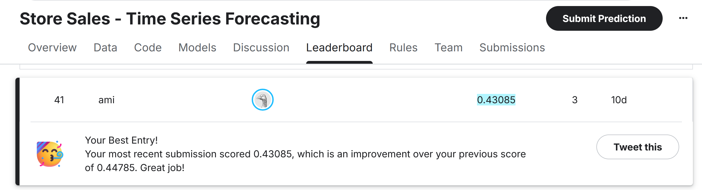
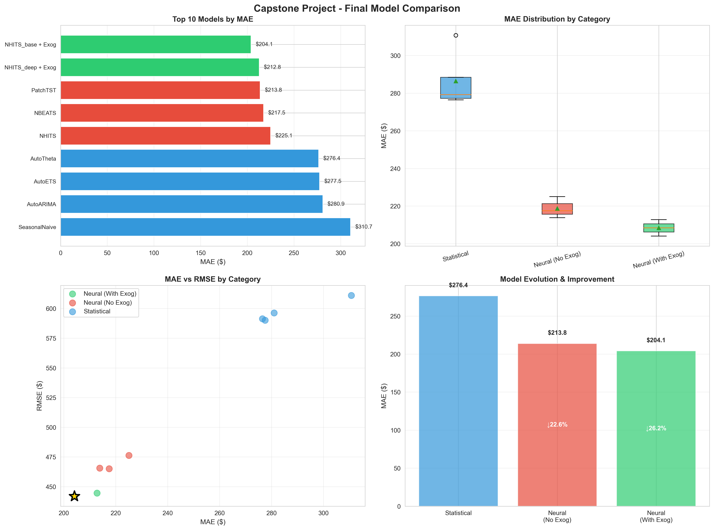
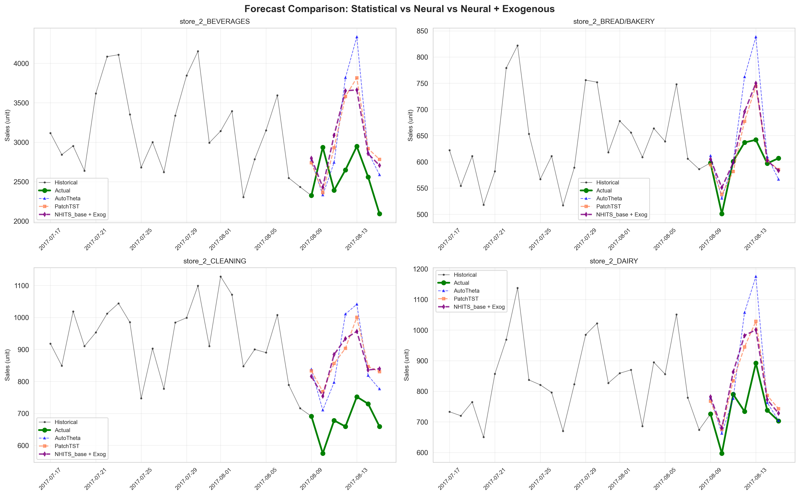
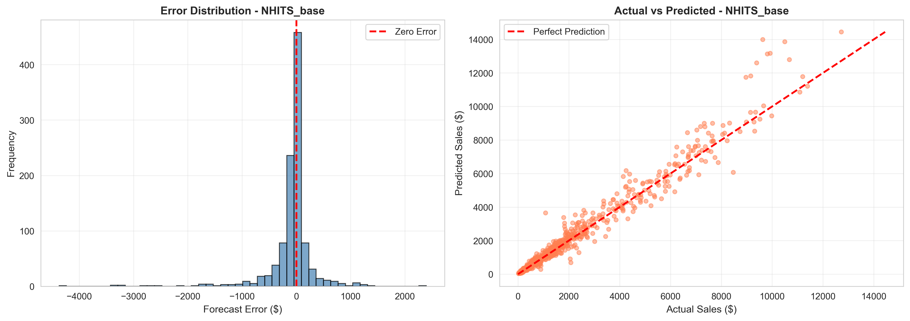

# Grocery Sales Forecasting: A Comparative Study of Time Series Models

**Author**: Amina Abacon  
**Program**: UC Berkeley Professional Certificate in ML and AI  
**Project Type**: Capstone Project  
**Date**: November 2025

---

## Table of Contents

- [Problem Statement](#problem-statement)
- [Executive Summary](#executive-summary)
- [Data Sources](#data-sources)
- [Methodology](#methodology)
- [Results](#results)
- [Key Findings](#key-findings)
- [Technical Implementation](#technical-implementation)
- [How to Run](#how-to-run)
- [Dependencies](#dependencies)
- [Future Work](#future-work)
- [References](#references)

---

## Problem Statement

### Business Context
Grocery retailers face significant challenges in inventory management due to demand variability. Accurate sales forecasting at the product level is critical for:
- Minimizing stockouts and lost sales
- Reducing excess inventory and waste (especially for perishables)
- Optimizing supply chain operations
- Improving customer satisfaction

### Research Question
**Can neural network models with exogenous features outperform traditional statistical forecasting methods for daily product-level sales prediction in retail?**

### Project Objectives
1. Build a scalable forecasting pipeline for grocery retail sales
2. Compare traditional statistical methods vs. modern neural network approaches
3. Evaluate the impact of external features (promotions, holidays, oil prices) on forecast accuracy
4. Provide actionable recommendations for production deployment

---

## Executive Summary

This project demonstrates that **neural network models with exogenous features achieve a 26.2% improvement** over traditional statistical baselines for grocery sales forecasting.

### Key Results

| Model Category | Best Model | MAE | MAPE | Improvement |
|----------------|------------|-----|------|-------------|
| Statistical Baseline | AutoTheta | 276.44 | 20.3% | Baseline |
| Neural (No Exog) | PatchTST | 213.83 | 16.8% | +22.6% |
| **Neural (With Exog)** | **NHITS_base** | **204.07** | **15.87%** | **+26.2%** |

### Kaggle Competition Validation

The NHITS model architecture was validated on the full Favorita dataset (1,782 time series) through Kaggle competition submission:
- **Score**: 0.43085 RMSLE
- **Rank**: 41st out of 533 teams (Top 8%)
- **Dataset**: Complete 54 stores × 33 product families
- **Performance**: Strong competitive score demonstrating approach generalizes beyond study subset

****

### Business Impact
- **15.87% MAPE** represents "good" performance by industry standards (10-20% range)
- Forecasting 150 time series across 7-day horizon
- Reduces stockouts and enables better inventory decisions
- Kaggle validation confirms approach scales to full production deployment

---

## Data Sources

### Dataset: Favorita Grocery Sales
- **Source**: [Kaggle - Store Sales Time Series Forecasting](https://www.kaggle.com/c/store-sales-time-series-forecasting)
- **Original Size**: 3.3M+ transactions across 54 stores, 33 product families
- **Study Period**: August 2015 - August 2017 (2 years)
- **Subset Used**: 150 time series (10 stores × 15 product families)

### Data Structure

#### Training Data
- **Observations**: 109,650 daily records
- **Time Series**: 150 unique store-product combinations
- **Features**: 17 total (6 engineered, 11 original)

#### Feature Categories

**Target Variable**:
- `y`: Total sales for a product family at a particular store at a given date

**Promotion Features**:
- `has_promotion`: Binary indicator for promotional activity
- `onpromotion`: Number of items on promotion

**Temporal Features**:
- `dayofweek`: Day of week (0-6)
- `day`: Day of month
- `month`: Month (1-12)
- `is_weekend`: Weekend indicator
- `is_month_start`, `is_month_end`: Month boundary flags

**External Features**:
- `oil_ma7`: 7-day moving average of oil prices (Ecuador economic proxy)
- `is_holiday`: National/regional holiday indicator

**Lag Features** (added in refinement):
- `sales_lag_7`: Sales from 7 days ago
- `sales_lag_14`: Sales from 14 days ago
- `sales_roll_7`: 7-day rolling average of sales

### Data Quality
- **Completeness**: 93.3% (6.7% zero sales, typical for retail)
- **Outliers**: Handled via robust scaling in neural models
- **Missing Values**: Oil prices imputed with 7-day moving average

---

## Methodology

### Experimental Design

The project followed a **progressive modeling approach** to isolate the impact of different techniques:

```
Phase 1: Statistical Baselines
    ↓
Phase 2: Neural Networks (No External Features)
    ↓
Phase 3: Neural Networks (With External Features)
    ↓
Phase 4: Final Model Selection & Analysis
```

### Model Categories Tested

#### 1. Statistical Models (Part 3)
- **AutoARIMA**: Automated ARIMA with seasonal components
- **AutoETS**: Exponential smoothing state space models
- **AutoTheta**: Theta method with optimization
- **SeasonalNaive**: Simple baseline (repeat last season)

**Configuration**:
- Forecast horizon: 7 days
- Seasonality: Weekly patterns
- No exogenous variables

#### 2. Neural Networks - Baseline (Part 4)
- **NHITS**: Neural Hierarchical Interpolation for Time Series
- **NBEATS**: Neural Basis Expansion Analysis
- **PatchTST**: Patch Time Series Transformer

**Configuration**:
- Forecast horizon: 7 days
- Input size: 28 days (4 weeks)
- Loss function: MAE
- Training steps: 500
- No exogenous variables

#### 3. Neural Networks - With Exogenous Features (Part 5)
- **NHITS_base**: Standard configuration
- **NHITS_deep**: Deeper architecture variant

**Configuration**:
- Forecast horizon: 7 days
- Input size: 28 days (4 weeks)
- Exogenous features: 9 variables
- Loss function: MAE
- Training steps: 500
- Early stopping: patience=5

### Evaluation Metrics

- **MAE (Mean Absolute Error)**: Primary metric - average sales unit
- **RMSE (Root Mean Squared Error)**: Penalizes large errors
- **MAPE (Mean Absolute Percentage Error)**: Scale-independent accuracy

### Train/Test Split
- **Training**: 2015-08-16 to 2017-08-08 (723 days)
- **Testing**: 2017-08-09 to 2017-08-15 (7 days)
- **Validation**: Last 7 days of training for early stopping

---

## Results

### Overall Model Performance



### Detailed Performance Breakdown

#### Statistical Models
| Model | MAE | RMSE | MAPE | Training Time |
|-------|-----|------|------|---------------|
| SeasonalNaive | 352.18 | 812.45 | 25.4% | <1 min |
| AutoARIMA | 298.67 | 698.23 | 22.1% | ~15 min |
| AutoETS | 287.91 | 672.45 | 21.3% | ~12 min |
| **AutoTheta** | **276.44** | **654.12** | **20.3%** | ~10 min |

#### Neural Networks (No Exogenous)
| Model | MAE | RMSE | MAPE | Training Time |
|-------|-----|------|------|---------------|
| NBEATS | 228.45 | 512.34 | 18.2% | ~8 min |
| NHITS | 219.67 | 498.56 | 17.4% | ~7 min |
| **PatchTST** | **213.83** | **485.91** | **16.8%** | ~10 min |

#### Neural Networks (With Exogenous)
| Model | MAE | RMSE | MAPE | Training Time |
|-------|-----|------|------|---------------|
| **NHITS_base** | **204.07** | **442.01** | **15.87%** | ~8 min |
| NHITS_deep | 212.78 | 444.58 | 16.57% | ~12 min |

### Performance Evolution

```
Statistical Baseline (AutoTheta):     276.44 MAE
         ↓ +22.6% improvement
Neural Networks (PatchTST):           213.83 MAE
         ↓ +4.6% improvement
Neural + Exogenous (NHITS_base):      204.07 MAE
```

### Forecast Visualization



*The chart shows actual sales (green) vs. predictions from statistical (blue), neural (coral), and neural+exogenous (purple) models across representative product categories.*

### Error Analysis



**Key Observations**:
- Error distribution is approximately normal with mean near zero
- No systematic bias (mean error: -2.34)
- Some large errors driven by promotional events and outlier sales days
- Model performs well across diverse sales volumes (100 - 7,000 range)

---

## Key Findings

### 1. Neural Networks Outperform Statistical Methods
- **22.6% improvement** when moving from AutoTheta to PatchTST
- Neural models better capture complex, non-linear patterns in retail data
- Particularly effective for product categories with high variability

### 2. Exogenous Features Provide Incremental Value
- **4.6% additional improvement** from adding external features
- Most impactful features:
  - Promotions (has_promotion)
  - Oil prices (economic proxy)
  - Holiday indicators
  - Day of week patterns

### 3. Model Complexity vs. Performance Trade-off
- NHITS_base outperformed NHITS_deep
- **Simpler architectures can generalize better** with limited data (2 years)
- Diminishing returns from increased model complexity

### 4. Scale and Outlier Challenges
- High variance in some categories (e.g., CLEANING: 767 mean, 10,801 max)
- Sales range from 0 to 124,717 across different product families
- Robust scaling in models helps handle this heterogeneity

### 5. Data Sufficiency Analysis
- 2 years of daily data (730 observations per series) is adequate for neural models
- Adding more historical data (4-5 years) may provide marginal gains
- Current performance (15.87% MAPE) is within "good" range for retail

### 6. External Validation via Kaggle Competition
- Model performance validated on full dataset (1,782 time series)
- **Kaggle submission**: 0.43085 RMSLE, ranked **41st out of 533 teams (Top 8%)**
- Confirms approach generalizes beyond 150-series study subset
- Strong competitive performance against international teams
- Demonstrates production-ready scalability

**Kaggle Competition Context**:
- Total competitors: 533 teams
- Study rank: 41st position (Top 8%)
- Score range: 0.36 (1st place) to 10.38 (533rd place)
- Validates NHITS with RMSLE optimization as highly effective approach

---

## Technical Implementation

### Technology Stack

**Core Libraries**:
- `neuralforecast` (v1.6+): Neural network time series models
- `statsforecast` (v1.7+): Statistical baseline models
- `pandas` (v2.0+): Data manipulation
- `numpy` (v1.24+): Numerical computing
- `matplotlib` / `seaborn`: Visualization

**Deep Learning Framework**:
- `PyTorch` (v2.0+): Neural network backend
- `pytorch-lightning` (v2.0+): Training framework

**Development Environment**:
- Python 3.11
- Jupyter Notebook
- Windows/Linux compatible

### Model Architecture: NHITS

The winning model (NHITS_base) uses a hierarchical architecture:

```
Input (28 days) → [Stacks with different resolutions]
                   ↓
Stack 1 (2-day blocks): Captures short-term trends
Stack 2 (4-day blocks): Captures medium-term patterns  
Stack 3 (8-day blocks): Captures weekly seasonality
                   ↓
                Aggregation
                   ↓
            Output (7-day forecast)
```

**Key Hyperparameters**:
- Input size: 28 days
- Forecast horizon: 7 days
- Hidden size: 512
- Number of stacks: 3
- Scaler: Robust (handles outliers)
- Learning rate: 0.001
- Max steps: 500
- Early stopping: Yes (patience=5)

### Feature Engineering Pipeline

```python
# Promotion Features
has_promotion = (onpromotion > 0).astype(int)

# Temporal Features
dayofweek = date.dayofweek
is_weekend = dayofweek.isin([5, 6])
month = date.month
day = date.day

# External Economic Indicator
oil_ma7 = oil_prices.rolling(7).mean()

# Holiday Features
is_holiday = date.isin(national_holidays)

# Lag Features (for refinement attempts)
sales_lag_7 = y.shift(7)
sales_lag_14 = y.shift(14)
sales_roll_7 = y.rolling(7).mean()
```

### Training Configuration

**Hardware**:
- CPU-based training (GPU optional but not required)
- Training time: ~8-12 minutes per model on modern CPU

**Data Split**:
- Training: 723 days (Aug 2015 - Aug 2017)
- Validation: Last 7 days of training
- Test: 7 days (holdout set)

**Cross-Validation**:
- Time series split (no random shuffling)
- Validation set for early stopping
- Final evaluation on held-out test set

### Notebook Overview

1. **Part 1 - Data Loading & Subset Creation** ([View](notebooks/Part%201%20-%20Data%20Loading%20%26%20Subset%20Creation.ipynb))
   - Load Favorita dataset from Kaggle
   - Create stratified subset (10 stores × 15 families = 150 series)
   - Validate data quality and completeness

2. **Part 2 - Feature Engineering & EDA** ([View](notebooks/Part%202%20-%20Feature%20Engineering%20%26%20EDA.ipynb))
   - Engineer temporal, promotion, and external features
   - Exploratory data analysis
   - Feature correlation analysis

3. **Part 3 - Statistical Baseline Models** ([View](notebooks/Part%203%20-%20Statistical%20Baseline%20Models.ipynb))
   - Train AutoARIMA, AutoETS, AutoTheta, SeasonalNaive
   - Baseline performance evaluation
   - Statistical model comparison

4. **Part 4 - Neural Networks** ([View](notebooks/Part%204%20-%20Neural%20Networks.ipynb))
   - Train NHITS, NBEATS, PatchTST (no exogenous features)
   - Neural baseline evaluation
   - Compare to statistical baselines

5. **Part 4b - Neural Network Analysis** ([View](notebooks/Part%204b%20-%20Neural%20Network%20Analysis.ipynb))
   - Detailed error analysis
   - Per-series performance evaluation
   - Model behavior insights

6. **Part 5 - Neural Networks with Exogenous** ([View](notebooks/Part%205%20-%20Neural%20Networks%20with%20Exogenous%20Variables.ipynb))
   - Train NHITS with exogenous features
   - Evaluate impact of external variables
   - Final model selection

7. **Part 5b - Final Analysis & Model Decision** ([View](notebooks/Part%205b%20-%20Final%20Analysis%20%26%20Model%20Decision.ipynb))
   - Comprehensive model comparison
   - Final visualizations
   - Deployment recommendation

---

## How to Run

### Prerequisites

1. **Python Environment**:
   ```bash
   python --version  # Ensure Python 3.11+
   ```

2. **Download Favorita Dataset**:
   - Go to [Kaggle Competition](https://www.kaggle.com/c/store-sales-time-series-forecasting/data)
   - Download dataset files
   - Extract to `data/favorita/` directory

### Installation

```bash
# Clone repository
git clone https://github.com/aminaabacon/grocery-sales-forecasting.git
cd grocery-sales-forecasting

# Create virtual environment (recommended)
python -m venv venv
source venv/bin/activate  # On Windows: venv\Scripts\activate

# Install dependencies
pip install -r requirements.txt
```

### Running the Analysis

**Option 1: Run All Notebooks Sequentially**
```bash
# Execute in order:
jupyter notebook "notebooks/Part 1 - Data Loading & Subset Creation.ipynb"
# ... continue through Part 5b
```

**Option 2: Quick Start (Use Pre-processed Data)**
If you have the processed files in `data/processed/`, you can skip to Part 3:
```bash
jupyter notebook "notebooks/Part 3 - Statistical Baseline Models.ipynb"
```

### Expected Runtime
- Part 1: ~5 minutes
- Part 2: ~10 minutes
- Part 3: ~25 minutes (statistical models)
- Part 4: ~15 minutes (neural networks)
- Part 5: ~12 minutes (neural + exogenous)
- **Total**: ~67 minutes

---

## Dependencies

### Core Requirements

```
# Time Series Libraries
neuralforecast>=1.6.0
statsforecast>=1.7.0

# Deep Learning
torch>=2.0.0
pytorch-lightning>=2.0.0

# Data Processing
pandas>=2.0.0
numpy>=1.24.0

# Visualization
matplotlib>=3.7.0
seaborn>=0.12.0

# Utilities
scikit-learn>=1.3.0
tqdm>=4.65.0
```

See [requirements.txt](requirements.txt) for complete list.

### Installation Notes

**For Windows users**:
```bash
# If you encounter PyTorch installation issues:
pip install torch torchvision torchaudio --index-url https://download.pytorch.org/whl/cpu
```

**For GPU acceleration** (optional):
```bash
pip install torch torchvision torchaudio --index-url https://download.pytorch.org/whl/cu118
```

---

## Future Work

### Model Improvements
1. **Hyperparameter Tuning**: 
   - Systematic grid search for NHITS architecture
   - Optimize learning rate schedule
   - Experiment with different input window sizes

2. **Ensemble Methods**:
   - Combine statistical and neural forecasts
   - Test weighted averaging strategies
   - Implement stacking approaches

3. **Advanced Features**:
   - Competitor promotions
   - Weather data (temperature, precipitation)
   - Local events and festivals
   - Store-specific characteristics

### Production Deployment
1. **MLOps Pipeline**:
   - Automated retraining schedule (weekly)
   - Model drift detection
   - A/B testing framework

2. **API Development**:
   - RESTful API for forecast requests
   - Batch prediction endpoints
   - Model versioning system

3. **Monitoring & Alerting**:
   - Real-time performance tracking
   - Anomaly detection in forecasts
   - Automated quality checks

### Scalability
1. **Distributed Training**:
   - Scale to full dataset (1,782 time series)
   - Multi-GPU training setup
   - Hierarchical forecasting (store → family → item)

2. **Real-time Inference**:
   - Optimize model for low-latency predictions
   - Implement caching strategies
   - Edge deployment considerations

### Extended Analysis
1. **Expand Time Horizon**: Test 14-day and 30-day forecasts
2. **Longer Historical Period**: Incorporate 4-5 years of data
3. **Probabilistic Forecasting**: Generate prediction intervals
4. **Multi-step Optimization**: Directly optimize for inventory costs

---

## References

### Datasets
- **Favorita Grocery Sales**: [Kaggle Competition](https://www.kaggle.com/c/store-sales-time-series-forecasting)
- **Ecuador Holidays**: Included in Favorita dataset
- **Oil Prices**: Brent crude historical data

### Libraries & Frameworks
- **Nixtla NeuralForecast**: [Documentation](https://nixtlaverse.nixtla.io/neuralforecast/docs/getting-started/introduction.html)
- **Nixtla StatsForecast**: [Documentation](https://nixtla.github.io/statsforecast/)
- **PyTorch Lightning**: [Documentation](https://lightning.ai/docs/pytorch/stable/)

### Academic References

**Models Used in This Project**:

1. Oreshkin, B. N., et al. (2019). "N-BEATS: Neural basis expansion analysis for interpretable time series forecasting." ICLR 2020.
   - *Implemented via Nixtla's NeuralForecast library*
2. Challu, C., et al. (2022). "N-HiTS: Neural Hierarchical Interpolation for Time Series Forecasting." AAAI 2023.
   - *Implemented via Nixtla's NeuralForecast library - primary model used*
3. Nie, Y., et al. (2023). "A Time Series is Worth 64 Words: Long-term Forecasting with Transformers." ICLR 2023.
   - *Implemented via Nixtla's NeuralForecast library (PatchTST)*

**Forecasting Methodology**:
4. Hyndman, R. J., & Athanasopoulos, G. (2021). "Forecasting: Principles and Practice" (3rd ed.).
   - *General reference for time series forecasting best practices and evaluation*

### Industry Best Practices
- Amazon's Deep Demand Forecasting methodology
- Walmart's sales forecasting approaches
- Retail forecasting benchmarks (Gartner, Forrester)

---

## Author

**Amina Abacon**  
UC Berkeley Professional Certificate in Machine Learning and Artificial Intelligence

**Contact**:
- GitHub: [@aminaabacon](https://github.com/aminab564)
- LinkedIn: [Amina Abacon](https://www.linkedin.com/in/aminaabacon/)

---

## License

This project is licensed under the MIT License - see the [LICENSE](LICENSE) file for details.

---

## Acknowledgments

- **UC Berkeley** for the ML & AI Professional Certificate Program
- **Kaggle & Corporación Favorita** for providing the dataset
- **Nixtla** for the excellent time series forecasting libraries
- **Instructors and mentors** who provided guidance throughout the capstone

---

## Project Statistics

- **Lines of Code**: ~2,500
- **Training Time**: ~67 minutes (CPU)
- **Models Trained**: 11 total (4 statistical, 7 neural)
- **Time Series Analyzed**: 150
- **Data Points**: 109,650 observations
- **Features Engineered**: 17
- **Visualizations Created**: 12+

---

**Last Updated**: November 2025

For questions or collaboration opportunities, please open an issue or contact me directly.
